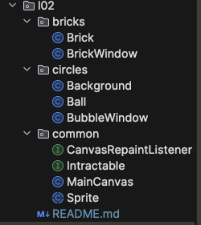

# Java JDK. Lesson02
## Program interfaces

### About project  
>Приведенный код реализует простое графическое приложение, отрисовывающее "Броуновское движение" без эмуляции физики. Каждый объект движется произвольно и взаимодействует только с границами окна.

В этом разделе важно не особенно обращать внимание на то, какие именно классы и методы используются, а внимательно следить за взаимодействием и отношениями объектов, потому что интерфейсы, о которых далее планируется говорить – это механизм упрощающий и универсализирующий взаимодействия объектов.

### Project structure  
  

[x] [BubbleWindow - the carrier window for circles](./circles/BubbleWindow.java)  
[x] [MainCanvas - panel for painting](./common/MainCanvas.java)  
[x] [Sprite - abstract class for future figures](./common/Sprite.java)  

